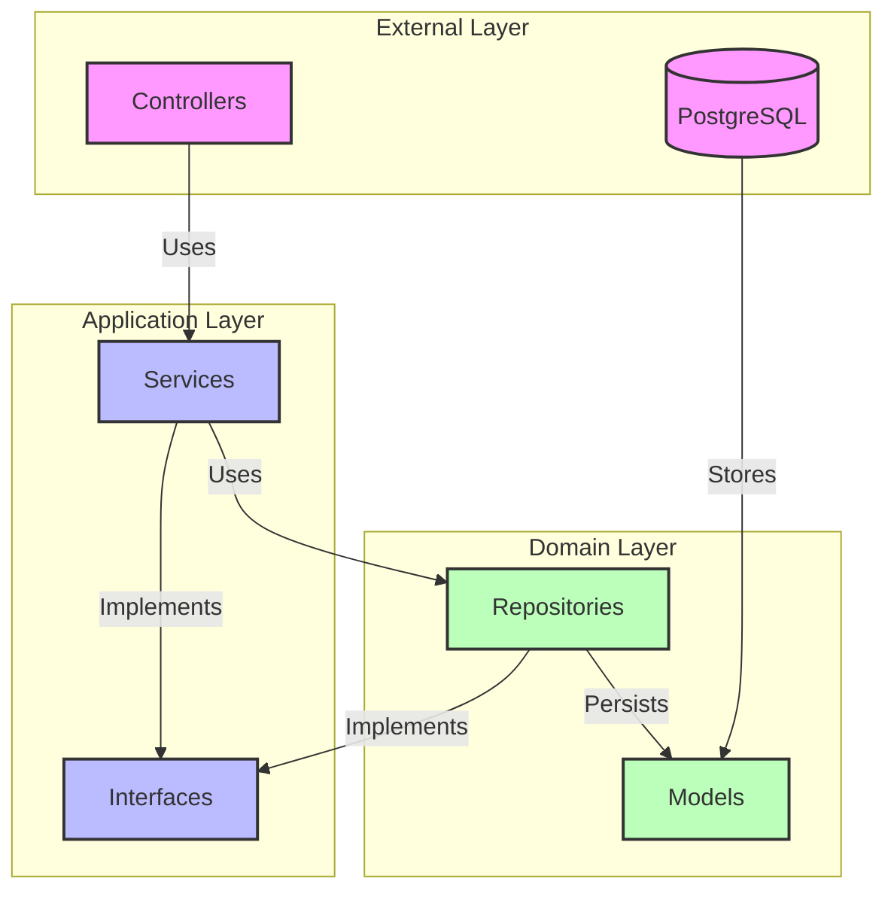
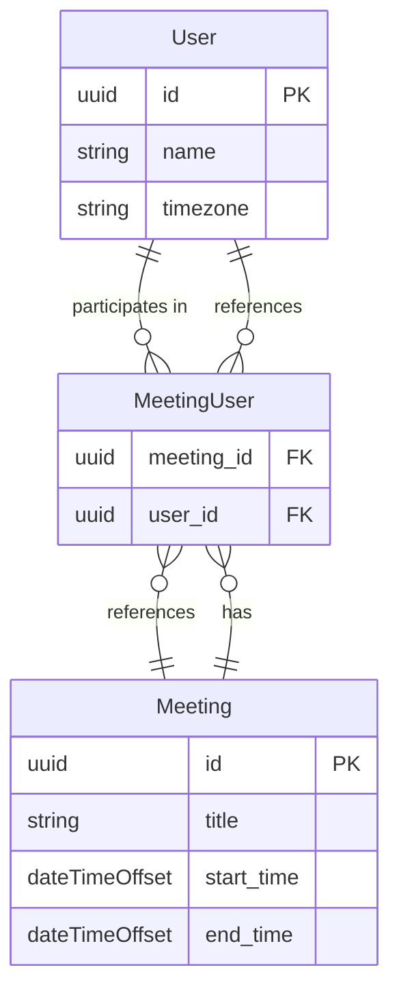

# Enterprise Scheduler

A .NET Web API project for enterprise-level scheduling and task management.

## ℹ️Description

This project provides a robust API for managing and scheduling meetings. The API supports flexible timezone handling:
- Accepts meeting times in any timezone (any offset)
- Automatically converts all times to UTC for storage
- Converts meeting times to the user's local timezone when retrieving their meetings
- Checks for scheduling conflicts and suggests alternative time slots when conflicts are found

## 🚀 CI/CD and Quality Assurance

This project implements a comprehensive CI/CD pipeline using GitHub Actions to ensure code quality and maintainability:

### Automated Workflows

1. **Format Check**
   - Runs on every push
   - Ensures consistent code formatting using `dotnet format`
   - Maintains clean and standardized code style

2. **Test Coverage**
   - Runs on pull requests to main branch
   - Executes all unit tests with coverage reporting
   - Enforces minimum code coverage threshold of 95%
   - Posts detailed coverage reports as PR comments
   - Generates coverage badges for quick reference

### Pull Request Process

The project includes a structured pull request template that:
- Guides contributors through the PR process
- Categorizes changes (bug fixes, features, documentation, etc.)
- Ensures consistent PR documentation
- Helps maintain high-quality code reviews

## 🛫Getting Started

### Prerequisites

- .NET 8.0 SDK
- Docker

### Running the Project

1. Clone the repository
```bash
git clone https://github.com/YOUR_USERNAME/REPO_NAME.git
```

2. Navigate to the project directory
```bash
cd EnterpriseScheduler
```

3. Start the PostgreSQL database using Docker Compose
```bash
docker compose up -d
```

This will start a PostgreSQL container with the following configuration:
- Port: 5432
- Database: scheduler_db
- Username: scheduler
- Password: scheduler123

### Database Migrations

If you're running the project for the first time, you'll need to apply the database migrations:

```bash
dotnet tool install --global dotnet-ef

dotnet ef database update --project src/EnterpriseScheduler/EnterpriseScheduler.csproj
```
### PostgreSQL console

To get inside PSQL:

```bash
docker exec -it scheduler-postgres psql -U scheduler -d scheduler_db
```

### Run the project

```bash
dotnet run --project src/EnterpriseScheduler/EnterpriseScheduler.csproj
```

The API will be available at `http://localhost:5085`

### Stopping the Database

When you're done, you can stop the PostgreSQL container:

```bash
docker compose down
```

## 📄API Documentation

The API documentation is available [here at `/swagger`](http://localhost:5085/swagger/index.html) when running the application.

### Postman Collection

A comprehensive Postman collection is available in the `docs/api` directory. This collection includes all API endpoints with example requests and responses.

### Collection Details
- Location: `docs/api/enterprise-scheduler-api.postman_collection.json`
- Includes all endpoints for:
  - Meetings management
  - User management
  - Timezone handling
  - Conflict resolution

### Importing the Collection
1. Open Postman
2. Click "Import" button
4. Select `enterprise-scheduler-api.postman_collection.json`

### Variable Setup
1. Hover the variable named `baseUrl` on any postman request and when the value window pops, type the new value `http://localhost:5085`

## ⚠️Troubleshooting

### Common Issues

1. **Port 5432 is already in use**
   - Check if you have another PostgreSQL instance running
   - Stop the other instance or change the port in docker-compose.yml

2. **Docker Desktop not running**
   - Make sure Docker Desktop is running before executing docker compose commands
   - Start Docker Desktop from the Start menu

## 📌Architecture



## 🔗DB diagram


